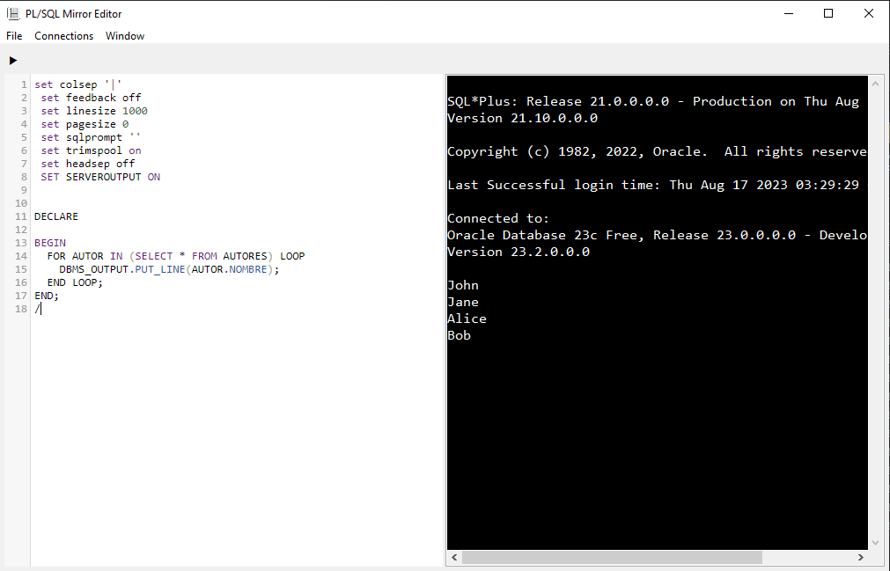

# PL/SQL Mirror Editor

The PL/SQL Mirror Editor is a versatile tool for working with PL/SQL code, offering features to enhance your coding experience. Whether you're writing, reviewing, or debugging PL/SQL scripts, this editor provides an intuitive interface and a range of functionalities to boost your productivity.

## Features

- **Syntax Highlighting**: Clearly visualize different elements of your PL/SQL code with syntax highlighting for improved code readability.

- **Code Completion**: Increase your coding speed and accuracy with intelligent code suggestions and auto-completion.

- **Code Navigation**: Easily navigate through your PL/SQL codebase using a range of navigation tools and shortcuts.

- **Error Detection**: Detect and fix errors quickly with real-time syntax and logic error highlighting.
